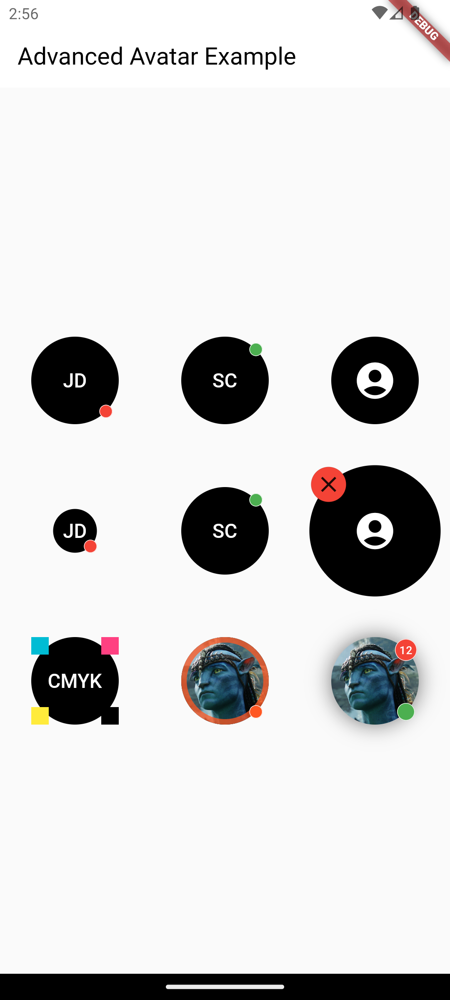
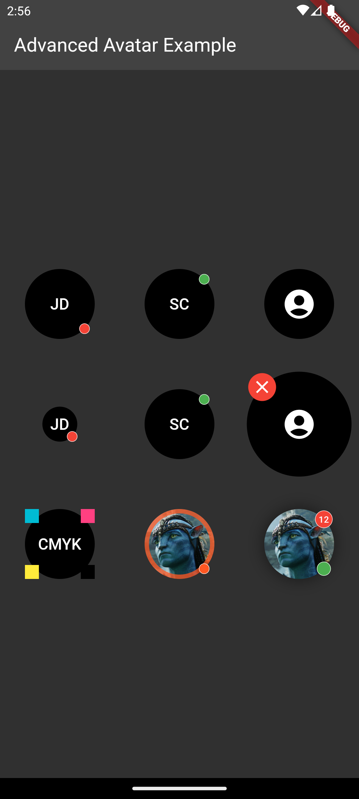

# flutter_advanced_avatar

An advanced avatar provides a rich API for widget customization that opens a new look and feel in your app.

## Advanced Avatar Theme LAF
| Advanced Avatar Light Theme | Advanced Avatar Dark Theme |
|:-:|:-:|
|  |  |

## AdvancedAvatar Parameters
| Parameter              | Description                                           | Type                 | Default            |
|:-----------------------|:------------------------------------------------------|:---------------------|:-------------------|
| `name`                 | Used for creating initials. (Regex split by r'\s+\/') | *String*             ||
| `size`                 | Avatar size (width = height).                         | *double*             | 80.0               |
| `image`                | Avatar image source exclusively with [child].         | *ImageProvider*      ||
| `margin`               | Avatar margin.                                        | *EdgeInsetsGeometry* ||
| `style`                | Initials text style.                                  | *TextStyle*          ||
| `statusColor`          | Status color.                                         | *Color*              ||
| `statusSize`           | Status size.                                          | *double*             | 12.0               |
| `statusAlignment`      | Status alignment.                                     | *Alignment*          | Alignment.topRight |
| `decoration`           | Avatar decoration.                                    | *BoxDecoration*      | color, shape       |
| `foregroundDecoration` | Avatar foreground decoration.                         | *BoxDecoration*      ||
| `child`                | Child widget exclusively with [image].                | *Widget*             ||
| `children`             | Hosted widgets.                                       | *Widget*             ||